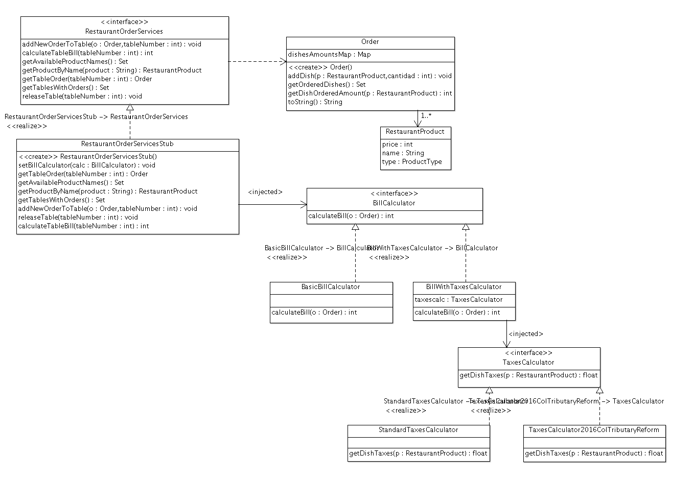

### Escuela Colombiana de Ingeniería

### Arquitecturas de Software

## Parcial segundo corte para el cálculo de cuentas de restaurantes.

### Descripción

En este proyecto se va a construír un API REST que permita calcular el valor total de una cuenta de restaurante, teniendo en cuenta las políticas y regímenes tributarios configurados para la misma.

Este API será soportado por el siguiente modelo de clases, el cual considera el principio de inversión de dependencias, y asume el uso de Inyección de dependencias:

El anterior modelo considera, por ahora, los siguientes casos (la aplicación podrá configurarse de acuerdo con el restaurante donde sea usado):

* En algunos restaurantes -ilegales- los precios de los platos NO tienen gravamen alguno (BasicBillCalculator).
* En muchos otros se cobra el IVA, pero de dos maneras diferentes:
	* 16% estándar sobre todos los productos (CalcularodCuentaConIVA + VerificadorIVAEstandar).
	* Con la reforma tributaria de 2016, aplicando un IVA diferencial al tipo de producto: 16% para las bebidas y 19% para los platos.

Por defecto, el manejador de órdenes tiene dos órdenes registradas para las mesas #1 y #3:

* Orden Mesa 1:

	| Producto      | Cantidad | Precio Unitario          | 
	| ------------- | ----- |:-------------:| 
	|PIZZA|3|$10000|
	|HOTDOG|1|$3000|
	|COKE|4|$1300|

* Orden Mesa 3:

	| Producto      | Cantidad | Precio  Unitario         | 
	| ------------- | ----- |:-------------:| 
	|HAMBURGER|2|$12300|
	|COKE|2|$1300|

### Ejercicio

1. Configure su aplicación para que ofrezca el recurso "/orders", para esto:
   * Modifique la clase OrdersAPIController para que exponda el servicio REST necesario por medio de SpringMVC/SpringBoot.

2. Configure su aplicación para que al realizar una petición GET, retorne -en formato jSON- el conjunto de todas las órdenes y sus totales, es decir, tiene que retornar el listado de todos los productos por Orden y un campo en donde aparezca el valor total de la cuenta.
	
	* Importante, para el calculo del total de cada orden debe utilizar la clase "edu.eci.arsw.myrestaurant.beans.impl.BasicBillCalculator" 

### Bono

Haga que a la aplicación se le inyecte el bean BasicBillCalculator y BillWithTaxesCalculator. Para esto utilice el principio de los Beans revisados en laboratorios anteriores y realice la inyección de dependencias entre éstos mediante las anotaciones @Autowired y @Service.
* Nota:  Tiene que hacer que la clase "BillWithTaxesCalculator" utilice a "edu.eci.arsw.myrestaurant.beans.impl.colombia.StandardTaxesCalculator" para realizar su calculo, no es necesario que se inyecte.
